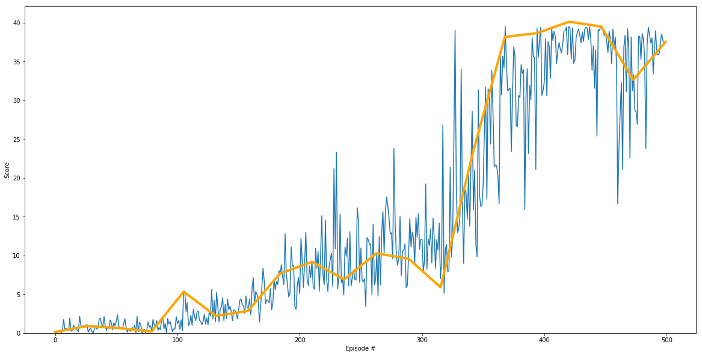

[//]: # (Image References)

[image1]: images/reacher.gif "Trained Agent"

# Project 2: Continuous Control
## Udacity Deep Reinforcement Learning
The purpose of this document is to describe the details of the project; including the algorithm, network architecture, training hyperparameters and results.

Most of the code for this project is based on the course work and repository for [DDPG Bipedal](https://github.com/udacity/deep-reinforcement-learning/tree/master/ddpg-bipedal)

--- 
## Project overview 
The goal of this project was to train an agent to control a double-jointed arm such that it would track a ball around. 

![image1]

As described in the project: *A reward of +0.1 is provided for each step that the agent's hand is in the goal location. Thus, the goal of your agent is to maintain its position at the target location for as many time steps as possible.*

*The observation space consists of 33 variables corresponding to position, rotation, velocity, and angular velocities of the arm. Each action is a vector with four numbers, corresponding to torque applicable to two joints. Every entry in the action vector should be a number between -1 and 1.*

## Algorithm 

The algorithm used is:
**Deep Deterministic Policy Gradient (DDPG)** The algorithm adapts the ideas underlying the success of Deep Q-Learning to the continuous
  action domain. It is classified an actor-critic, model-free algorithm based on the deterministic policy gradient that can operate over continuous action spaces.

An **actor** is used to tune the parameters 𝜽 for the policy function i.e. decide the best action for a specific state while a **critic** is used to evaluate the policy function estimated by the actor according to the temporal difference (TD) error (*TD learning is a way to learn how to predict a value depending on future values for a given state, similar to Q-Learning*). 

To improve stability, DDPG borrows the ideas of **experience replay** and **fixed Q-targets** from DQN.

One side-effect using a policy-based approach is the tendency to converge at local minima; to mitigate this a noise is added to the action during training to encourage exploration. 

The network architecture for the

Actor:
* State input BatchNorm layer
* 2 Fully connected layers followed by Relu activation and BatchNorm
* Output Layer has action 4 outputs followed by Tanh activation to constrain outputs to -1 to +1

Critic:
* 1st Layer is State input to a Fully connected layer (128) followed by Relu activation and BatchNorm
* 2nd Layer additionally takes the action from to a Fully connected layer (128) followed bu a Relu activation
* Output layer with a single output.

The link to the paper [Continous Control with Deep Reinforcement Learning](https://arxiv.org/pdf/1509.02971.pdf). 

## Training  
In this section we present the results from training; including the hyper parameters and average score achieved after training. 

Training (after much experimentation) used the following hyperparameters:
- Replay buffer size **100000** 
- Minibatch size **64**
- Discount factor (gamma) **0.99**
- Soft update interpoloation (TAU) **1e-3**
- Learning rate of the actor **1e-4**
- Learning rate of the critic **1e-4**
- Number of episodes played **500**
- Max time (number of steps) per episode **1000** 

The following plot shows the score achieved during training; demonstrating the agent was able to meet the 30 point score goal after roughly 350 episodes. 

## Ideas for Future Work 
The amount of experimentation that could be performed was somewhat limited because of availability GPU compute time to perform training. Some ideas include: 
- Try solving using the 2nd option with 20 agents. The training time is likely to improve.
- Train the agent using pixel inputs as demonstrated by the authors of rhe paper which would be quite cool and can be of great significance 
- Further experimentation on the network architecture to find a more optimum architecture
